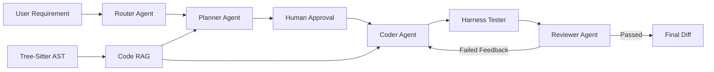

# AI Coding Agent 项目面试表达文档

## 1. STAR 法则完整表达模板

STAR 用来回答“你做过什么、怎么做、结果如何”。建议每个项目故事控制在 2 到 4 分钟。

### Situation：背景

表达目标：说明项目为什么要做，业务或团队当时遇到了什么真实问题。

模板：

> 当时我们团队面临【业务/研发背景】，主要痛点是【痛点 1】、【痛点 2】、【痛点 3】。这些问题导致【交付、质量、效率、成本上的影响】。在这个背景下，我们希望通过【项目方向】来解决【核心目标】。

示例：

> 当时团队需求交付压力比较大，代码质量不稳定，开发自测效率低，很多重复性编码和代码审查工作依赖人工完成。随着业务迭代加快，传统开发流程已经很难兼顾交付速度和质量，所以我们希望把 AI Coding Agent 引入内部研发流程，构建一套覆盖需求分析、代码生成、自动测试和代码审查的 AI 辅助编程方案。

### Task：任务

表达目标：说明你负责什么，以及项目成功标准是什么。

模板：

> 我在项目中主要负责【你的角色和职责】，核心任务包括【任务 1】、【任务 2】、【任务 3】。我们定义的成功标准是【可衡量指标】，例如【效率提升、缺陷下降、覆盖率提升、自动化比例提升】。

示例：

> 我作为核心成员主导方案设计和落地，负责多 Agent 工作流设计、Tree-Sitter 代码语义解析、Code RAG 检索、Harness 测试闭环接入，以及前后端功能集成。项目成功标准是让 Agent 能基于规范自动生成实现方案和代码，生成后自动测试，失败后自动修复，同时让代码审查自动化程度提升。

### Action：行动

表达目标：讲清楚你如何解决问题，突出技术方案、取舍和落地细节。

模板：

> 我主要做了几件事：第一，【动作 1】，解决了【问题】；第二，【动作 2】，提升了【能力】；第三，【动作 3】，形成了【闭环】；第四，【动作 4】，保障了【稳定性/可扩展性/可维护性】。

示例：

> 我首先把 SDD 规范驱动开发思想融入 Agent 工作流，设计了 Router、Planner、Coder、Tester、Reviewer 多 Agent 架构。Planner 根据需求和编码规范生成实施方案，Coder 生成代码 diff，Tester 调用 Harness 执行测试，Reviewer 从规范、性能、安全和测试结果四个维度审查。其次，我基于 Tree-Sitter 实现多语言 AST 解析和函数级语义切片，结合 Code RAG 给 Agent 提供项目上下文。最后，我把测试结果和审查反馈回传给 Coder，形成生成、测试、审查、修复的自动闭环。

### Result：结果

表达目标：必须量化，不要只说“效果很好”。

模板：

> 最终项目带来了【量化结果 1】、【量化结果 2】、【量化结果 3】。同时，在团队流程上沉淀了【规范/平台/工具/机制】，后续可以复用到【更多场景】。

示例：

> 项目落地后，团队需求完成量明显提升，重复性编码工作减少，代码审查自动化程度提高。通过 Harness 测试闭环，生成代码在进入人工 review 前就能完成基础验证，Bug 逃逸率下降。团队调研反馈开发效率有明显提升，AI 辅助编码覆盖率也逐步提升。

## 2. 讲故事方法论

面试中不要直接堆技术名词。更好的表达顺序是：

> 发现问题 → 数据证明 → 分析根因 → 对比方案 → A/B 验证 → 量化结果

### 2.1 发现问题

表达模板：

> 我们最初发现的问题不是“缺一个 AI 工具”，而是研发流程中存在几个具体低效点：【需求理解成本高】、【代码上下文查找慢】、【自测反馈慢】、【代码审查依赖人工经验】。

可讲内容：

- 需求从描述到实现缺少结构化规范。
- 新人或跨模块开发时，理解历史代码成本高。
- 单元测试和集成测试经常滞后。
- Review 只能覆盖部分规范问题，容易漏掉重复性问题。

### 2.2 数据证明

表达模板：

> 我们没有一开始就做大平台，而是先收集研发流程数据，确认瓶颈主要集中在【需求澄清】、【代码检索】、【重复实现】和【测试反馈】几个环节。

可用指标：

- 单个需求从评审到开发完成的平均耗时。
- 代码 review 中重复性问题占比。
- 自测失败后定位问题的平均耗时。
- 缺陷来源中“边界条件遗漏”“规范不一致”的占比。
- Agent 生成代码一次通过率、测试通过率、人工采纳率。

### 2.3 分析根因

表达模板：

> 根因不是开发人员能力不足，而是流程中缺少机器可执行的规范、缺少准确的代码上下文、缺少自动化反馈闭环。

根因拆解：

- 需求非结构化：自然语言需求很难直接变成可执行任务。
- 上下文不足：普通 LLM 不知道项目已有结构和工程风格。
- 测试反馈慢：生成代码后如果只靠人工检查，反馈周期太长。
- Review 标准不稳定：不同 reviewer 关注点不一致。

### 2.4 对比方案

| 方案 | 优点 | 缺点 | 结论 |
| --- | --- | --- | --- |
| 直接接入 ChatGPT/通用 LLM | 接入快，成本低 | 不理解项目上下文，输出不可控 | 适合辅助问答，不适合流程闭环 |
| 只做 Code RAG 问答 | 能提升代码理解效率 | 不能完成自动生成、测试、修复 | 作为基础能力保留 |
| 单 Agent 自动编码 | 架构简单 | 规划、编码、审查职责混在一起，不易控制质量 | 不适合复杂研发流程 |
| SDD + 多 Agent + Harness | 规范清晰，职责分离，可形成闭环 | 实现复杂，需要设计状态流转和失败重试 | 最终采用 |

### 2.5 A/B 验证

表达模板：

> 我们先选择部分低风险需求进行 A/B 验证，一组按传统方式开发，另一组使用 AI Agent 辅助流程，对比需求完成时间、测试通过率、review 问题数量和人工采纳率。

验证维度：

- 开发耗时：传统流程 vs Agent 辅助流程。
- Review 问题数：人工 review 前后问题数量变化。
- 测试通过率：Coder 生成后 Harness 首轮通过率。
- 修复效率：失败后自动修复轮数和最终通过率。
- 人工采纳率：最终 diff 被开发者接受的比例。

### 2.6 量化结果

表达模板：

> 验证后我们发现，AI Agent 对重复性编码、规范检查和测试反馈场景效果最好。最终团队需求完成量提升，Bug 数量同比下降，代码审查自动化比例提高，开发人员主观反馈也更愿意在日常开发中使用。

可替换量化句：

- 需求完成量提升约 X%。
- 单个需求平均开发耗时下降 X%。
- 基础规范类 review 问题减少 X%。
- Harness 首轮测试通过率达到 X%。
- Agent 生成 diff 人工采纳率达到 X%。
- Bug 逃逸率下降 X%。

## 3. 项目全链路表达

可以按这个顺序讲完整项目：

> 需求分析 → 架构设计 → 技术选型 → 项目实现 → 面试表达 → 复盘沉淀 → 面试题

## 4. 需求分析

### 业务痛点

- 需求交付压力大，研发节奏快。
- 代码质量参差不齐，规范问题重复出现。
- 开发自测效率低，测试反馈链路慢。
- 新人理解项目结构和历史代码成本高。
- Code review 依赖人工经验，覆盖范围有限。

### 用户角色

- 开发人员：希望快速理解需求、生成代码、补测试。
- Tech Lead：希望统一规范、降低 review 成本。
- 测试人员：希望更早发现缺陷，减少后期返工。
- 团队管理者：希望提升交付效率和质量稳定性。

### 核心目标

- 把自然语言需求转成结构化 SDD 实施方案。
- 让 Agent 能理解代码库上下文和工程风格。
- 让生成代码自动进入测试和审查闭环。
- 把人工经验沉淀为可复用的规范、流程和工具。

## 5. 架构设计

### 总体架构



### Agent 职责

| Agent | 职责 |
| --- | --- |
| Router | 识别用户意图，判断是问答、分析、编码还是缺陷扫描 |
| Planner | 基于 SDD 规范生成实施方案、影响范围、测试策略 |
| Coder | 根据方案和代码上下文生成 unified diff |
| Tester | 调用 Harness 执行单元测试和集成测试 |
| Reviewer | 从规范、性能、安全、测试结果维度审查 |

### 闭环机制

```text
生成代码 → 临时工作区应用 diff → Harness 测试 → Reviewer 审查
       ↑                                      |
       └──────────── 失败反馈 + 修复建议 ─────┘
```

## 6. 技术选型

| 技术 | 用途 | 选择原因 |
| --- | --- | --- |
| LangGraph | 多 Agent 工作流编排 | 支持状态图、节点流转、interrupt/resume |
| Tree-Sitter | 多语言 AST 解析 | 支持 Python/Java/JS/TS/Vue 等语义解析 |
| FastAPI | 后端 API | 异步能力好，开发效率高 |
| pgvector / Embedding | Code RAG 检索 | 支持代码语义相似度检索 |
| Harness | 自动化测试闭环 | 能统一执行单元测试和集成测试 |
| Docker | 部署交付 | 方便前后端、数据库和运行环境统一 |
| Vue | 前端工作台 | 适合构建 IDE 风格交互界面 |

## 7. 项目实现

### 7.1 SDD + AI Agent 工作流融合

实现要点：

- 引入 SDD，把需求先转成规范化方案，而不是直接生成代码。
- 多 Agent 职责拆分，避免单 Agent 既规划又编码又审查。
- 在 Planner 后加入人工确认节点，保证关键方案可控。
- Coder 只输出 unified diff，便于审查、回滚和应用。

面试表达：

> 我没有让 Agent 直接从需求生成代码，而是先生成 SDD 方案，让人确认目标、影响文件、测试策略和风险。这样可以把不可控的自然语言需求转成可审查、可执行的中间产物。后续 Coder 只根据已批准方案生成 diff，降低了生成结果偏离需求的风险。

### 7.2 Harness 自动化测试集成

实现要点：

- 生成 diff 后不直接写入真实项目，而是复制到临时工作区。
- 在临时工作区用 `git apply --check` 校验 diff。
- 自动发现 `harness.json`、`harness.yml` 或根据项目类型推断测试命令。
- 测试失败后将 stdout/stderr 和摘要反馈给 Coder。

面试表达：

> 我们把 Harness 接到 Agent 工作流里，让生成代码必须先经过自动化测试。失败信息不会只展示给用户，而是回传给 Coder 作为下一轮修复上下文，这样形成了生成、测试、修复闭环。

### 7.3 多语言代码语义理解

实现要点：

- 使用 Tree-Sitter 解析 Python、Java、JavaScript、TypeScript、Vue 等语言。
- 按函数、类、方法级别做语义切片。
- 将切片内容写入向量库，支持 Code RAG 检索。
- Agent 在生成方案和代码时优先使用检索到的项目上下文。

面试表达：

> 仅靠文件级检索会给 Agent 太多噪音，所以我基于 Tree-Sitter 做了函数级语义切片。这样 Agent 能拿到更精准的上下文，比如相关函数、类和调用片段，生成代码更容易贴合现有工程结构和编码风格。

### 7.4 Reviewer 自动审查

实现要点：

- 审查维度包括代码规范、性能、安全和 Harness 测试结果。
- 输出结构化 JSON，包含 `passed`、`summary`、`findings`。
- 存在 blocker 或测试失败时自动进入下一轮修复。

面试表达：

> Reviewer 的作用不是替代人工 review，而是把重复性、标准化的问题提前拦截掉。比如基础规范、安全风险和测试失败，这些问题在进入人工 review 前就应该被自动发现。

## 8. 面试表达版本

### 30 秒版本

> 我主导落地了一个 AI Coding Agent 平台，用 SDD 规范驱动开发理念，把需求分析、代码生成、自动测试和代码审查串成闭环。技术上基于 LangGraph 设计 Router、Planner、Coder、Tester、Reviewer 多 Agent 工作流，基于 Tree-Sitter 做多语言 AST 解析和函数级代码切片，结合 Code RAG 提供项目上下文。代码生成后会自动调用 Harness 测试，失败后把错误反馈给 Coder 重新修复。最终提升了团队交付效率，降低了重复性 review 和 Bug 逃逸。

### 2 分钟版本

> 当时团队面临需求交付压力大、代码质量不稳定、开发自测效率低的问题。我作为核心成员主导把 AI Coding Agent 落地到研发流程中。  
>   
> 我们没有直接让大模型生成代码，而是引入 SDD 规范驱动开发。用户提交需求后，Router 先识别任务类型，Planner 根据需求、编码规范和代码上下文生成实施方案，人工确认后 Coder 才生成 diff。生成代码之后，Tester 会在临时工作区应用 diff，并调用 Harness 执行测试。测试失败会把错误信息回传给 Coder 触发重新生成。最后 Reviewer 会从代码规范、性能、安全和测试结果四个维度做自动审查。  
>   
> 为了解决 Agent 不理解代码库的问题，我基于 Tree-Sitter 实现了 Python、Java、JavaScript、TypeScript、Vue 等语言的 AST 解析和函数级语义切片，再结合向量检索构建 Code RAG，让 Agent 能拿到精准的项目上下文。  
>   
> 最终这套方案覆盖了需求分析、代码生成、自动测试和代码审查链路，减少了重复性编码和人工 review 成本，团队需求完成量提升，Bug 数量下降，开发人员反馈提效明显。

### 5 分钟版本结构

1. 背景：团队交付压力、质量不稳定、自测效率低。
2. 痛点：需求非结构化、上下文不足、测试反馈慢、review 不稳定。
3. 方案：SDD + 多 Agent + Code RAG + Harness。
4. 架构：Router、Planner、Coder、Tester、Reviewer。
5. 难点：代码语义切片、测试闭环、失败重试、审查结构化。
6. 结果：效率提升、Bug 下降、自动化覆盖提高。
7. 复盘：哪些场景适合 AI，哪些仍需人工控制。

## 9. 复盘沉淀

### 做得好的地方

- 没有直接追求“自动写代码”，而是先做规范化中间层。
- 多 Agent 职责清晰，便于调试和扩展。
- Harness 测试闭环降低了生成代码的风险。
- Code RAG 提升了 Agent 对项目上下文的理解能力。

### 遇到的挑战

- LLM 输出不稳定，需要结构化约束和降级兜底。
- 不同语言 AST 结构不同，语义切片需要做兼容。
- 测试命令和环境差异大，Harness 需要支持配置和自动推断。
- Agent 自动修复不能无限重试，需要设置最大轮数。

### 可继续优化

- 引入更细粒度的调用图分析。
- 对 Reviewer findings 做规则库沉淀。
- 增加代码变更风险评分。
- 建立 Agent 生成结果的采纳率和失败原因看板。
- 把团队编码规范沉淀成可执行的 SDD 模板。

## 10. 面试题与回答要点

### 1. 为什么要用 SDD，而不是直接让 Agent 写代码？

回答要点：

- 直接生成代码不可控，容易偏离需求。
- SDD 可以把自然语言需求转成可审查的规范。
- Planner 输出方案后人工确认，降低返工风险。
- Coder 只负责按方案生成 diff，职责更清晰。

### 2. 为什么用多 Agent，而不是单 Agent？

回答要点：

- 单 Agent 职责过重，规划、编码、测试、审查容易互相干扰。
- 多 Agent 可以职责分离，便于调试和扩展。
- 每个 Agent 可以有不同提示词、模型和质量门禁。
- 工作流状态更清晰，适合企业研发流程。

### 3. LangGraph 在项目中解决了什么问题？

回答要点：

- 管理多 Agent 节点流转。
- 支持状态传递和条件分支。
- 支持 interrupt/resume，用于人工审批。
- 支持失败后回到 Coder 重新生成。

### 4. Code RAG 为什么要做函数级切片？

回答要点：

- 文件级上下文太长，噪音大。
- 函数级切片更接近代码真实语义。
- 检索结果更精准，能提升生成代码的一致性。
- Tree-Sitter 可以跨语言解析函数、类、方法节点。

### 5. Harness 测试闭环怎么设计？

回答要点：

- Coder 输出 diff 后先进入临时工作区。
- 用 `git apply --check` 校验 diff 可应用。
- 自动发现或配置测试命令。
- 测试失败后把错误摘要、stdout、stderr 反馈给 Coder。
- 设置最大重试次数，避免无限循环。

### 6. Reviewer 自动审查和人工 Review 的关系是什么？

回答要点：

- Reviewer 不是替代人工，而是前置拦截重复性问题。
- 自动审查适合规范、安全、性能和测试结果类问题。
- 人工 Review 仍关注业务逻辑、架构合理性和产品语义。
- 自动审查可以减少人工 Review 的低价值负担。

### 7. 如何保证 AI 生成代码不会污染真实项目？

回答要点：

- Coder 只输出 unified diff。
- 先在临时工作区应用 diff。
- 测试通过和审查通过后才允许用户应用到真实项目。
- 保留 diff 形式，方便审查、回滚和追踪。

### 8. 如果 LLM 输出格式不稳定怎么办？

回答要点：

- 用强约束提示词要求输出 JSON 或 unified diff。
- 对输出做解析和校验。
- 失败时给出本地模板或兜底结果。
- Reviewer 输出结构化 JSON，便于程序判断是否通过。

### 9. 项目最大的技术难点是什么？

回答要点：

- 不是单点接入 LLM，而是把 LLM 纳入工程闭环。
- 难点包括上下文准确性、测试反馈、失败重试、状态管理。
- 通过 Tree-Sitter + Code RAG 解决上下文问题。
- 通过 LangGraph + Harness 解决流程闭环问题。

### 10. 如果重新做一遍，你会怎么优化？

回答要点：

- 引入更精细的调用链分析。
- 建立质量数据看板，如采纳率、失败率、重试次数。
- 把团队规范沉淀成可执行规则。
- 增加灰度策略，先覆盖低风险需求。
- 对 Agent 输出做离线评测和回归测试。

## 11. 一句话总结

> 这个项目的核心不是“接了一个大模型”，而是把 AI 编码能力工程化地接入研发流程，用 SDD 控制需求和方案，用 Code RAG 提供上下文，用 Harness 提供测试反馈，用 Reviewer 提供质量门禁，最终形成可控、可验证、可持续优化的 AI 辅助编程闭环。
