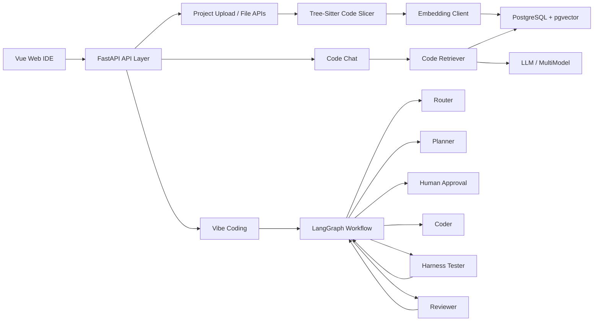

# AI Coding Workspace 快速吃透面试冲刺文档

目标：用最短时间把这个项目讲成“你真的做过、懂架构、懂取舍、能落地”的项目，面试时能稳定拿分。

你要记住一句话：

> 这个项目不是简单套壳大模型，而是把 AI 编码能力工程化接入研发流程：用 Code RAG 解决上下文，用 SDD 解决需求规范，用 LangGraph 解决流程编排，用 Harness 和 Reviewer 解决质量闭环。

## 1. 面试官到底想听什么

面试官问项目，表面问“你做了什么”，本质在判断 6 件事：

| 面试官判断点 | 你要证明什么 |
| --- | --- |
| 你是不是主导者 | 能讲清楚背景、目标、方案取舍和落地细节 |
| 你是不是懂架构 | 能从前端、后端、数据、Agent 工作流讲整体链路 |
| 你是不是懂 AI 工程化 | 不只会调 API，还知道上下文、评测、测试、审查、回滚 |
| 你是不是会解决问题 | 能讲出具体问题、根因、方案和结果 |
| 你是不是有质量意识 | 能讲测试闭环、Reviewer、diff 校验、失败重试 |
| 你是不是能复盘 | 能讲项目不足和下一步优化 |

所以不要一上来讲技术栈。应该先讲：

1. 团队痛点是什么。
2. 为什么普通 AI 问答不够。
3. 你设计了什么闭环。
4. 哪些技术点支撑这个闭环。
5. 最后怎么验证有效。

## 2. 3 天快速吃透路线

### Day 1：跑通产品，建立全局地图

目标：你要知道“用户点一下按钮后，代码走到哪里”。

必须完成：

- 启动前端：`aI-coding-workspace-frontend`
- 启动后端：`aI-coding-workspace-backend`
- 打开 Swagger：`http://127.0.0.1:8000/docs`
- 在前端看懂几个主要区域：文件树、代码编辑器、AI 面板、Vibe Coding、事件流、Git 面板、终端面板。

你要能回答：

- 用户上传项目后，后端做了什么？
- 用户问代码问题，如何检索上下文？
- 用户发起 Vibe Coding，为什么要先生成方案？
- Coder 生成的为什么是 diff，不是直接改文件？

Day 1 必背一句话：

> 前端是 Web IDE 入口，后端是 FastAPI 服务，核心能力在 engine 层，包括 LangGraph 工作流、Tree-Sitter 代码切片、Embedding 向量索引、Code RAG 检索和 Harness 测试闭环。

### Day 2：吃透后端核心链路

目标：你要能画出后端链路，并讲清楚每个文件的作用。

重点文件：

| 文件 | 你要掌握什么 |
| --- | --- |
| `app/engine/workflow.py` | LangGraph 节点、边、人工审批、失败重试 |
| `app/engine/state.py` | GraphState 存哪些状态 |
| `app/engine/agents/router.py` | 如何识别任务类型 |
| `app/engine/agents/planner.py` | 如何生成 SDD 方案 |
| `app/engine/agents/coder.py` | 如何生成 diff，如何接收反馈 |
| `app/engine/agents/tester.py` | 如何调用 Harness |
| `app/engine/agents/reviewer.py` | 如何做自动审查 |
| `app/engine/harness.py` | 如何临时应用 diff 并跑测试 |
| `app/engine/parser/code_slicer.py` | Tree-Sitter 如何切片 |
| `app/engine/vector/indexer.py` | 如何生成 embedding 并入库 |
| `app/engine/vector/retriever.py` | 如何按相似度检索上下文 |
| `app/api/v1/endpoints/vibe.py` | Vibe Coding API 如何串起工作流 |

Day 2 必背一句话：

> 后端核心不是某一个 Agent，而是一条可验证的状态机：Router 判断任务，Planner 生成 SDD 方案，人工确认后 Coder 生成 diff，Tester 在临时工作区跑 Harness，Reviewer 审查，失败则带着反馈回到 Coder 重试。

### Day 3：准备面试表达和追问

目标：你要能讲出“为什么这么设计”，而不是只背代码。

必须准备：

- 30 秒项目介绍。
- 2 分钟项目故事。
- 5 分钟架构讲解。
- 10 个高频追问。
- 3 个项目难点。
- 3 个优化结果。
- 2 个项目不足。

Day 3 必背一句话：

> 我在这个项目里最核心的贡献，是把 AI 编码从“单次生成”变成“工程闭环”：有规范、有上下文、有测试、有审查、有失败重试、有人工确认。

## 3. 一张图吃透项目



面试讲图时的顺序：

1. 前端是 IDE 交互层。
2. 后端 API 接收项目、问答和 Vibe 任务。
3. 项目上传后先做代码切片和向量索引。
4. Chat 走 RAG 问答链路。
5. Vibe Coding 走 LangGraph 多 Agent 工作流。
6. 测试和审查形成闭环。

## 4. 核心链路 1：Code RAG 怎么讲

### 4.1 用户问题到答案的流程

```text
用户提问
  -> EmbeddingClient 把问题转成向量
  -> pgvector 用 cosine_distance 找最相关代码片段
  -> 拼接代码上下文
  -> LLM 基于上下文回答
  -> SSE 流式返回前端
```

对应代码：

- 检索入口：`app/engine/vector/retriever.py`
- Embedding：`app/engine/vector/embeddings.py`
- Chat API：`app/api/v1/endpoints/chat.py`
- 前端调用：`src/stores/app.ts` 的 `sendChat`

### 4.2 面试表达

> 代码问答的关键是让模型不要凭空回答，所以我做了 Code RAG。项目上传后，后端会用 Tree-Sitter 对代码做函数级语义切片，然后用 Embedding 模型生成向量，存到 pgvector。用户提问时，我们只对问题做一次 embedding，再用 cosine distance 检索 topK 相关代码片段，拼进 prompt 给 LLM 回答。

### 4.3 面试官追问：为什么不用全文丢给大模型？

回答：

> 第一，长上下文成本高，速度慢；第二，大项目会超 token；第三，不相关代码会干扰模型。RAG 的好处是只取和问题最相关的代码片段，既降低成本，也提升回答准确性。

## 5. 核心链路 2：Tree-Sitter AST 切片怎么讲

### 5.1 为什么要 AST 切片

普通文本切片的问题：

```text
一个函数可能被切成两半，语义不完整。
```

AST 切片的优势：

```text
以函数、类、方法为最小语义单元，检索结果更贴近真实代码含义。
```

对应代码：

- `app/engine/parser/code_slicer.py`
- 核心函数：`slice_code_file`
- 关键结构：`CodeSlice`

### 5.2 面试表达

> 代码和普通文档不一样，它是结构化文本。如果按固定行数切片，一个函数可能被切成两半，embedding 后语义会丢失。所以我用 Tree-Sitter 解析 AST，按函数、类、方法节点切片，每个切片都记录文件路径、语言、符号名、起止行和内容。这样检索时能直接命中完整函数，而不是碎片代码。

### 5.3 面试官追问：Tree-Sitter 解析失败怎么办？

回答：

> 我做了降级策略。如果某种语言 grammar 不支持，或者文件里没有识别到函数/类节点，就退化成文件级切片，保证索引任务不中断。这是工程落地里很重要的容错设计。

## 6. 核心链路 3：Vibe Coding / SDD 工作流怎么讲

### 6.1 完整流程

```text
POST /api/vibe/start
  -> retrieve_code_context
  -> LangGraph.ainvoke
  -> Router
  -> Planner 生成 SDD 方案
  -> human_approval_node interrupt 暂停
  -> 前端展示方案

POST /api/vibe/confirm
  -> Command(resume={approved, feedback})
  -> Coder 生成 diff
  -> Tester 运行 Harness
  -> Reviewer 审查
  -> 失败则 retry_counter_node -> Coder
  -> 成功则结束
```

对应代码：

- API：`app/api/v1/endpoints/vibe.py`
- 工作流：`app/engine/workflow.py`
- 前端：`src/components/VibeTab.vue`
- 状态：`src/stores/app.ts`

### 6.2 面试表达

> Vibe Coding 不是让 AI 直接改代码，而是先走 SDD。用户提交需求后，Planner 先生成实施方案，包括目标、影响范围、实现步骤、测试策略和风险。这个方案会通过 LangGraph 的 interrupt 暂停，等用户确认。确认后 Coder 才生成 diff，后面再进入 Harness 测试和 Reviewer 审查。如果测试或审查失败，就把失败信息反馈给 Coder 重新生成，最多重试两轮。

### 6.3 面试官追问：为什么要人工确认？

回答：

> 因为需求理解错了，后面生成代码越自动化，错误放大越快。人工确认放在 Planner 后面，可以在成本最低的时候纠偏。它不是降低自动化，而是提高自动化的可信度。

## 7. 核心链路 4：Harness 测试闭环怎么讲

### 7.1 Harness 做什么

对应代码：

- `app/engine/harness.py`
- `run_harness`
- `_apply_diff`
- `discover_harness_commands`

流程：

```text
复制项目到临时目录
  -> git apply --check 校验 diff
  -> git apply 应用 diff
  -> 发现测试命令
  -> 执行测试
  -> 返回 passed / stdout / stderr / summary
```

### 7.2 面试表达

> 我没有让生成的 diff 直接污染真实项目，而是先复制一份临时工作区，在临时目录里执行 `git apply --check` 和 `git apply`。然后 Harness 会优先读取项目里的 `harness.json` 或 `harness.yml`，没有配置时再根据 `pyproject.toml`、`package.json`、`pom.xml` 等推断测试命令。测试失败时，把 stdout、stderr 和摘要返回给 Coder 作为下一轮修复依据。

### 7.3 面试官追问：为什么要临时工作区？

回答：

> 这是为了隔离风险。AI 生成代码不一定能应用，也不一定能通过测试。如果直接写真实项目，一旦失败会污染工作区。临时工作区可以先验证 diff 和测试，通过后再让用户决定是否应用。

## 8. 核心链路 5：Reviewer 自动审查怎么讲

对应代码：

- `app/engine/agents/reviewer.py`

Reviewer 输出：

```json
{
  "passed": true,
  "summary": "...",
  "findings": [
    {
      "severity": "blocker",
      "dimension": "security",
      "message": "..."
    }
  ]
}
```

面试表达：

> Reviewer 负责自动质量门禁，不是替代人工 review，而是前置拦截重复性问题。它会结合 diff 和 Harness 结果，从代码规范、性能、安全、测试结果四个维度输出结构化审查报告。如果有 blocker 或测试失败，工作流就不会结束，而是把反馈交给 Coder 重试。

## 9. 前端怎么讲

### 9.1 前端不是重点，但要能讲清楚

核心文件：

| 文件 | 作用 |
| --- | --- |
| `src/App.vue` | 总体布局 |
| `src/stores/app.ts` | 全局状态和 API action |
| `src/api/index.ts` | API 封装和 SSE 封装 |
| `src/components/CodeEditor.vue` | Monaco 编辑器 |
| `src/components/VibeTab.vue` | SDD/Vibe Coding 界面 |
| `src/components/ChatTab.vue` | 代码问答 |
| `src/components/EventsTab.vue` | 事件流展示 |
| `src/components/GitPanel.vue` | Git 操作面板 |
| `src/components/TerminalPanel.vue` | 浏览器终端 |

### 9.2 面试表达

> 前端我做成类似 VSCode 的工作台布局，左侧是项目和文件树，中间是 Monaco 编辑器，右侧是 AI 面板。AI 面板里包括 Chat、Vibe Coding 和事件流。状态统一放在 Pinia store 里，异步 action 负责调用后端 API。Chat 和 Vibe 的流式响应通过 fetch + ReadableStream 解析 SSE。

### 9.3 面试官追问：为什么不用 WebSocket？

回答：

> LLM token 输出和 Agent 事件大部分是服务端到客户端的单向流，SSE 更轻量，也更适合 HTTP/Nginx。WebSocket 更适合强双向实时协作，比如多人编辑或交互式终端。项目里终端类能力可以用 WebSocket，而 LLM 流式输出用 SSE。

## 10. 技术选型怎么讲

### LangGraph

为什么选：

- 多节点状态机比普通链式调用更适合复杂流程。
- 支持条件分支。
- 支持 interrupt/resume，适合人工审批。
- 支持 checkpointer 保存状态。

一句话：

> 我选 LangGraph 是因为 Vibe Coding 不是一条直链，而是有分支、暂停、恢复、失败重试的状态机。

### pgvector

为什么选：

- 项目本身已经用 PostgreSQL。
- 代码元数据和向量存在同一个数据库，事务一致性更好。
- 部署简单，不需要额外维护 Milvus/Qdrant。
- 中小规模代码库够用。

一句话：

> 在这个规模下，pgvector 的工程收益大于引入独立向量数据库的性能收益。

### Tree-Sitter

为什么选：

- 多语言支持好。
- 能识别函数、类、方法等语义节点。
- 比正则更稳定，比语言服务更轻量。

一句话：

> Tree-Sitter 让代码 RAG 从文本切片升级成语义切片。

### FastAPI

为什么选：

- 异步生态适合 LLM 调用和数据库访问。
- Pydantic 模型清晰。
- Swagger 文档自动生成。

### Vue + Monaco

为什么选：

- Vue 适合快速构建复杂前端状态。
- Monaco 提供接近 VSCode 的编辑体验。

## 11. 项目难点：面试重点讲这 4 个

### 难点 1：LLM 不理解项目上下文

问题：

> 通用模型不知道项目结构和已有代码风格，直接生成代码容易不一致。

解决：

> Tree-Sitter 语义切片 + Embedding + pgvector 检索，把相关代码片段作为上下文交给 Planner 和 Coder。

亮点：

> 不是简单 prompt，而是做了代码语义理解层。

### 难点 2：AI 生成代码不可控

问题：

> 需求理解偏差会导致生成结果不可控。

解决：

> 引入 SDD 和人工审批，让 Planner 先生成方案，用户确认后 Coder 才生成 diff。

亮点：

> 把风险控制前置到成本最低的规划阶段。

### 难点 3：生成后如何保证质量

问题：

> 只生成代码不代表能运行，也不代表符合规范。

解决：

> Harness 自动测试 + Reviewer 自动审查 + 失败重试。

亮点：

> 从“代码生成工具”升级成“质量闭环系统”。

### 难点 4：工作流如何暂停和恢复

问题：

> Planner 生成方案后要等用户确认，普通 async 调用无法持久等待。

解决：

> LangGraph `interrupt()` 暂停，checkpointer 保存状态，用户确认后用 `Command(resume=...)` 恢复。

亮点：

> 企业研发流程必须有人机协同，不能全自动黑箱执行。

## 12. 30 秒回答：背这个

> 这是一个 Web 版 AI Coding Workspace，对标 Cursor/Trae，但核心不是简单聊天，而是把 AI 编码接入研发流程。我负责核心 AI 工作流，基于 LangGraph 设计 Router、Planner、Coder、Tester、Reviewer 多 Agent 架构；基于 Tree-Sitter 做多语言 AST 语义切片，结合 pgvector 构建 Code RAG；在 Vibe Coding 中引入 SDD，让需求先生成方案并人工确认，再生成 diff；生成后通过 Harness 自动测试和 Reviewer 自动审查，失败则回传给 Coder 重试。最终形成需求分析、代码生成、自动测试、代码审查的闭环。

## 13. 2 分钟回答：背这个

> 当时团队遇到的问题是需求交付压力大、代码质量不稳定、开发自测效率低。普通 AI 问答只能辅助回答问题，不能真正接入研发流程，所以我主导做了一个 AI Coding Workspace。  
>
> 整体架构上，前端是 Vue + Monaco 的 Web IDE，后端是 FastAPI，核心能力放在 engine 层。项目上传后，后端用 Tree-Sitter 做多语言 AST 解析，把代码按函数、类、方法切成语义片段，再用 Embedding 存入 pgvector。用户提问时，通过 Code RAG 找到相关代码片段，再交给 LLM 回答。  
>
> 更核心的是 Vibe Coding。我没有让 AI 直接改代码，而是用 SDD 思路先生成实施方案。LangGraph 工作流里 Router 判断任务，Planner 生成方案，human approval 节点通过 interrupt 暂停，等用户确认后 Coder 生成 diff。diff 生成后会进入 Harness，在临时工作区校验并运行测试；之后 Reviewer 从规范、性能、安全和测试结果维度审查。如果失败，就把反馈传回 Coder 重试。  
>
> 这个项目最大的价值是把 AI 编码从一次性生成变成工程闭环，有上下文、有规范、有测试、有审查、有人工控制，能真正降低团队重复性编码和 review 成本。

## 14. 5 分钟架构讲法

按这个顺序讲，不要乱：

1. 背景：团队交付压力大，代码质量不稳定，自测效率低。
2. 目标：构建覆盖需求分析、代码生成、自动测试、代码审查的 AI 辅助研发闭环。
3. 分层：Vue Web IDE、FastAPI API、engine 核心层、PostgreSQL + pgvector。
4. Code RAG：Tree-Sitter 切片，Embedding 入库，pgvector 检索。
5. Vibe Coding：LangGraph 多 Agent 工作流，SDD 方案，人工确认，diff 生成。
6. 质量闭环：Harness 测试，Reviewer 审查，失败重试。
7. 结果：提升交付效率，降低重复性 review，减少 Bug 逃逸。
8. 复盘：后续可增强调用图、评测集、规则库和灰度策略。

## 15. 高频面试题：直接背答案

### Q1：这个项目和普通 ChatGPT 套壳有什么区别？

普通套壳只是把问题发给模型。这个项目做了三层工程化增强：

1. Code RAG：让模型知道项目上下文。
2. SDD 工作流：让模型先规划再编码。
3. Harness + Reviewer：让生成结果经过测试和审查。

所以它不是聊天工具，而是研发流程自动化平台。

### Q2：为什么 Coder 输出 diff，而不是直接修改文件？

diff 有三个好处：

1. 可审查：用户能看到改了什么。
2. 可验证：可以在临时工作区先应用测试。
3. 可回滚：失败时不会污染真实代码。

### Q3：失败重试怎么实现？

Reviewer 后面有条件边：

```text
如果 Harness passed 且 Review passed -> END
否则 retry_count + 1 -> 回到 Coder
超过 max_retries -> END
```

Coder 会接收上一轮的测试摘要和审查反馈，作为下一轮生成依据。

### Q4：为什么要 max_retries？

防止 Agent 无限循环。AI 修复不是必然成功，工程系统必须有边界。超过最大次数后交给人工处理，这符合人机协同原则。

### Q5：Code RAG 怎么保证准确？

主要靠三点：

1. Tree-Sitter 函数级语义切片。
2. Embedding 相似度检索 topK。
3. prompt 中要求只基于检索上下文回答。

后续还能加 BM25、重排序和调用图增强。

### Q6：如果 Embedding 服务不可用怎么办？

当前可以返回错误或走降级路径。工程上可以继续优化：

- 对已索引代码使用缓存。
- 对未索引项目走关键词检索。
- 对 Vibe Coding 使用已打开文件作为上下文。
- 在前端提示用户配置 API key。

### Q7：安全风险怎么控制？

主要控制点：

- 不直接执行模型生成的任意命令。
- diff 先在临时目录应用。
- 路径做项目根目录约束。
- Reviewer 增加安全维度审查。
- 真正应用 diff 需要用户点击确认。

### Q8：项目哪里体现高并发或异步能力？

后端使用 FastAPI async，数据库用 SQLAlchemy async，LLM 调用和 SSE 流式输出都是异步。对于长任务，比如索引和 Agent 工作流，后续可以接任务队列，但当前核心链路已经是异步友好的。

### Q9：如果代码库很大，RAG 怎么优化？

可以从 5 个方向优化：

- 增量索引，只处理变更文件。
- HNSW 索引提升向量检索性能。
- 混合检索：向量 + BM25。
- 重排序模型提高 topK 精度。
- 调用图过滤，优先检索相关依赖链。

### Q10：这个项目你最大的收获是什么？

> 最大收获是 AI 工程化不是调模型 API，而是把模型放进可控流程里。要有上下文、规范、质量门禁、失败重试、人工确认和可观测性，才能从 demo 变成团队能用的工具。

## 16. 面试官深挖源码时怎么答

### 他问：`workflow.py` 你怎么设计的？

答：

> 我把每个 Agent 设计成 LangGraph 节点，用 GraphState 传递状态。入口是 Router，编码类任务走 Planner，问答类任务走 QA。Planner 后面是 human_approval_node，通过 interrupt 暂停。确认后 Coder 生成 diff，再进入 Tester 和 Reviewer。Reviewer 后有条件边，如果测试和审查都通过就结束，否则进入 retry_counter_node 后回到 Coder。

### 他问：`vibe.py` 为什么要 `_json_safe`？

答：

> LangGraph 返回结果里可能包含 Interrupt 等运行时对象，不能直接写入 PostgreSQL JSONB。所以我在写 `agent_tasks.output_payload` 前用 JSON dumps/loads 做了一次 JSON-safe 转换，避免对象不可序列化导致 500。

### 他问：`harness.py` 怎么发现测试命令？

答：

> 优先读项目里的 `harness.json` 或 `harness.yml`，让项目自己声明测试命令。没有配置时再根据项目文件推断，比如 Python 项目跑 `python -m pytest`，Node 项目看 `package.json` 的 test/build，Java Maven 跑 `mvn test`。

### 他问：前端怎么拿到 Vibe 结果？

答：

> `VibeTab.vue` 调用 Pinia store 的 `startVibe`，store 再调 `/api/vibe/start`。后端返回 `waiting_approval` 和 `proposed_plan` 后，前端展示方案。用户确认后调用 `/api/vibe/confirm`，返回的 `generated_artifacts` 里包含 diff、Harness 结果和 Review 结果，前端更新状态展示。

## 17. 项目不足怎么讲

不要说“没问题”。成熟回答是：知道边界，并知道怎么优化。

### 不足 1：检索还可以更精准

当前是向量检索为主，后续可以加：

- BM25 关键词召回。
- Cross-encoder 重排序。
- 调用图上下文扩展。

### 不足 2：自动测试依赖项目环境

不同项目测试环境差异很大，后续可以加：

- Docker 沙箱。
- 项目级 harness 配置模板。
- 测试超时和资源限制。

### 不足 3：Reviewer 还依赖模型判断

后续可以把高频审查规则固化成静态规则：

- 安全规则库。
- 代码规范规则库。
- AST 规则扫描。
- LLM 只负责解释和补充建议。

## 18. 你要会画的 3 张图

### 图 1：整体架构

```text
Vue Web IDE -> FastAPI -> Engine -> PostgreSQL/pgvector -> LLM Provider
```

### 图 2：Code RAG

```text
Project Files -> Tree-Sitter -> CodeSlice -> Embedding -> pgvector
Question -> Embedding -> Retriever -> Context -> LLM -> Answer
```

### 图 3：Vibe Coding

```text
Requirement -> Planner -> Human Approval -> Coder -> Harness -> Reviewer
                                                ↑                 |
                                                └------ retry ----┘
```

## 19. 临场回答套路

### 遇到“你负责哪块”

答法：

> 我主要负责后端 AI 工作流和代码语义理解，也参与前端 Vibe Coding 展示联调。具体包括 LangGraph 多 Agent 工作流、Tree-Sitter 代码切片、Code RAG 检索、Harness 测试闭环、Reviewer 自动审查和 Vibe API。

### 遇到“项目有什么亮点”

答法：

> 三个亮点：第一，SDD + 多 Agent，把需求到代码变成可控流程；第二，Tree-Sitter + pgvector，让 Agent 理解项目上下文；第三，Harness + Reviewer，让生成代码经过自动测试和审查闭环。

### 遇到“项目难点是什么”

答法：

> 最大难点是把不稳定的 LLM 输出放进稳定的工程流程里。我的解决方式是用 SDD 做规划约束，用 diff 做变更边界，用 Harness 做可运行验证，用 Reviewer 做质量门禁，用 max_retries 控制失败循环。

### 遇到“结果如何量化”

答法：

> 可以从四类指标看：需求交付周期、Agent 生成 diff 采纳率、Harness 首轮通过率、Review 中重复性问题下降比例。我们落地后团队反馈重复性编码减少，review 自动化程度提升，Bug 逃逸率下降。

## 20. 背诵版项目总结

> 这个项目本质上是一个 AI 辅助研发工作台。它解决的问题不是“让模型回答问题”，而是“让模型参与真实研发流程”。我把项目分成四层：前端 Web IDE、FastAPI API 层、engine 核心能力层、PostgreSQL/pgvector 数据层。  
>
> Code RAG 负责让模型理解项目：Tree-Sitter 做函数级语义切片，Embedding 入库，pgvector 检索相关上下文。  
>
> Vibe Coding 负责让模型执行研发任务：LangGraph 编排 Router、Planner、Coder、Tester、Reviewer；Planner 先生成 SDD 方案并人工确认；Coder 生成 diff；Tester 用 Harness 在临时工作区跑测试；Reviewer 做规范、安全、性能审查；失败后自动带反馈重试。  
>
> 所以这个项目的价值是把 AI 编码从一次性生成，升级为有上下文、有规范、有测试、有审查、有人工确认的工程闭环。

## 21. 最后 1 小时冲刺清单

面试前 1 小时，只看这个：

- 会讲整体架构图。
- 会讲 Code RAG 流程。
- 会讲 Tree-Sitter 为什么比文本切片好。
- 会讲 LangGraph interrupt/resume。
- 会讲 Harness 临时工作区。
- 会讲 Reviewer 和失败重试。
- 会讲为什么 diff 不直接改文件。
- 会讲 3 个难点和 3 个优化方向。
- 会讲 30 秒版本和 2 分钟版本。

## 22. Offer 级别表达原则

最后记住：

1. 不要说“我用了 LangGraph”，要说“我用 LangGraph 解决了多 Agent 状态流转、人工审批和失败重试问题”。
2. 不要说“我用了 pgvector”，要说“我用 pgvector 把代码语义片段和向量存在同一个事务系统里，降低部署复杂度”。
3. 不要说“我用了 Tree-Sitter”，要说“我用 Tree-Sitter 把代码 RAG 从文本切片升级成函数级语义切片”。
4. 不要说“我接了 Harness”，要说“我让 AI 生成代码必须经过测试验证，失败反馈自动回流到 Coder”。
5. 不要说“我做了 AI 项目”，要说“我把 AI 能力接入了研发流程，并通过规范、上下文、测试和审查让它可控”。

这就是面试拿 offer 的表达方式。
